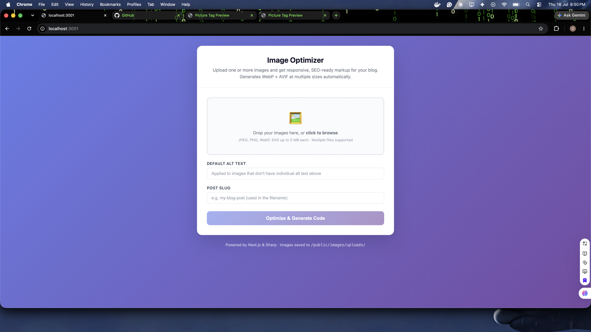
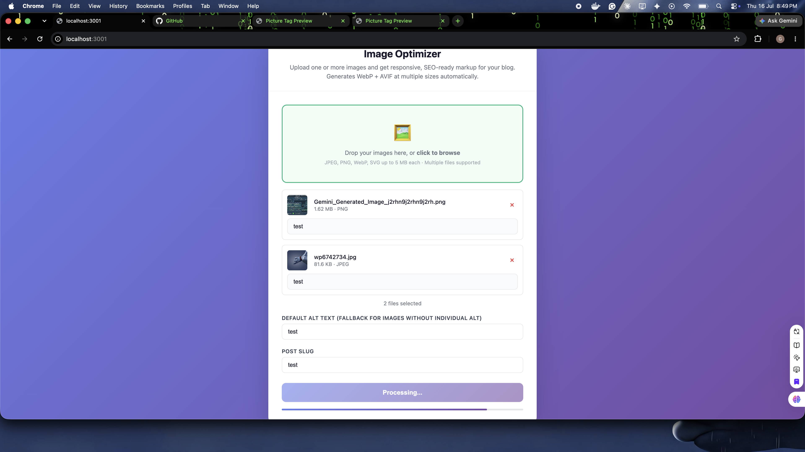
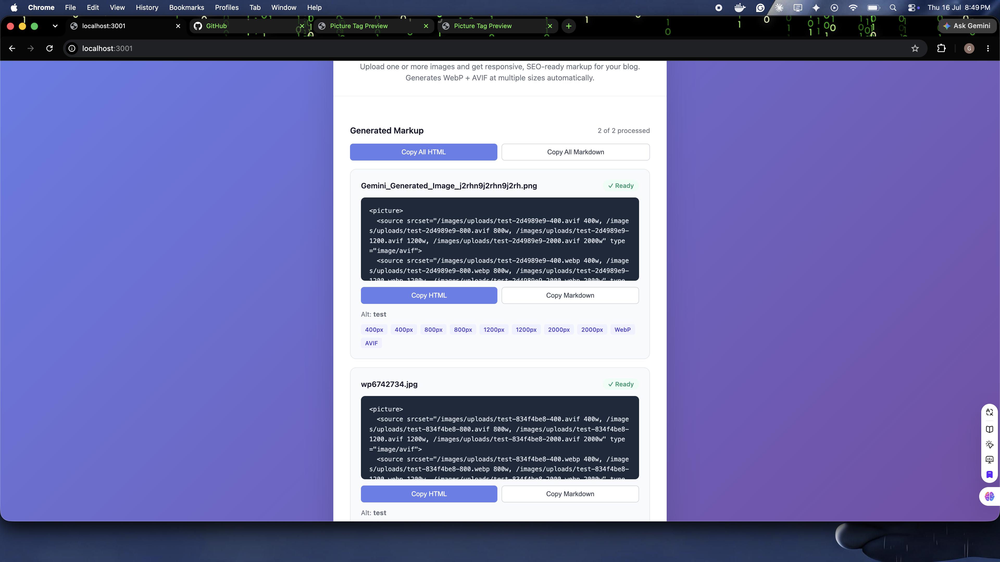
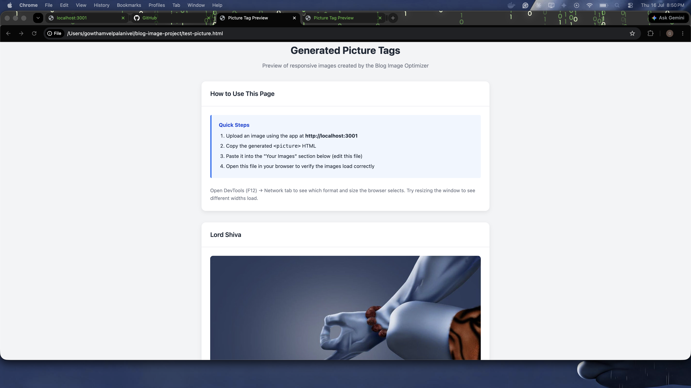
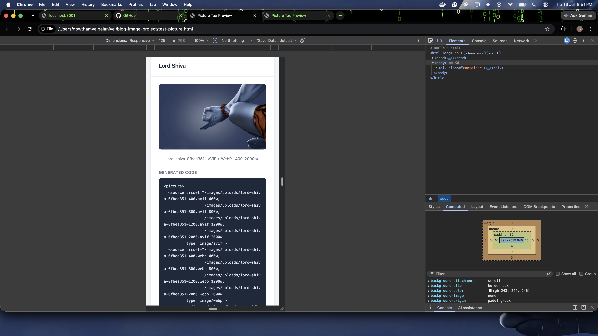

# Blog Image Optimizer

Upload an image, get back optimized versions ready to paste into your blog. The app resizes your image to multiple sizes and modern formats (WebP, AVIF) so it loads fast on any device.

## Screenshots

### Upload Interface

| Empty State | Files Selected |
|-------------|---------------|
|  |  |

### Processing & Results

| Processing | Results (Multiple Images) |
|------------|--------------------------|
|  |  |

### Blog Output Preview

| Desktop View | Mobile View (DevTools) |
|--------------|----------------------|
|  |  |

## What You Need Before Starting

You only need one thing installed on your computer:

- **Docker Desktop** - Download it free from [docker.com/products/docker-desktop](https://www.docker.com/products/docker-desktop/)

That's it. You don't need to install Node.js, npm, or anything else. Docker handles everything.

## How to Run It (3 steps)

### Step 1: Open a terminal

- **Mac**: Open the "Terminal" app (search for it in Spotlight with Cmd + Space)
- **Windows**: Open "PowerShell" from the Start menu

### Step 2: Go to the project folder

Type this and press Enter:

```bash
cd /path/to/blog-image-optimizer
```

Replace `/path/to/blog-image-optimizer` with the actual location where you saved this project.

### Step 3: Start the app

```bash
docker compose up --build -d
```

Wait about 30-60 seconds for it to finish building. You'll see some output scrolling by — that's normal.

### Step 4: Open it in your browser

Go to: **http://localhost:3001**

You should see the upload page.

## How to Use It

1. Drag and drop one or more images onto the upload area, or click to browse (JPEG, PNG, WebP, SVG — max 5 MB each)
2. Optionally type alt text for each image individually, or fill in the **Default Alt Text** field to apply to all
3. Optionally type in a post slug (like `my-first-blog-post` — used in filenames)
4. Click **Optimize & Generate Code** (or **Optimize N Images** for multiple)
5. Copy the generated HTML or Markdown for each image — or use **Copy All** for batch output
6. Paste the code into your blog

## Where Are My Processed Images?

After uploading, the optimized images are saved in:

```
blog-image-optimizer/public/images/uploads/
```

They stay there even if you stop the app.

## How to Stop the App

```bash
docker compose down
```

## How to Start It Again Later

```bash
docker compose up -d
```

(No need for `--build` the second time unless you've changed the code.)

## Troubleshooting

### "Port already in use" error

Something else is already using port 3001. Either close that other app, or change the port in `docker-compose.yml`:

```yaml
ports:
  - "3002:3000"   # change 3001 to any free port
```

Then visit `http://localhost:3002` instead.

### "Cannot connect to Docker daemon" error

Make sure Docker Desktop is running. Look for the whale icon in your menu bar (Mac) or system tray (Windows).

### Images don't show in test-picture.html

Open `test-picture.html` from the project folder directly in your browser. The images display using relative paths, so it only works when opened from within the project directory.

### Upload says "Invalid file type"

Only these image formats are accepted:
- JPEG (.jpg, .jpeg)
- PNG (.png)
- WebP (.webp)
- SVG (.svg)

### Upload says "Image processing failed"

The image might be corrupted or too large. Try a different image under 5 MB.

## What the App Does Behind the Scenes

1. You upload one image
2. It creates 8 versions: 4 sizes (400px, 800px, 1200px, 2000px wide) x 2 formats (WebP + AVIF)
3. It gives you a `<picture>` HTML tag that automatically serves the right size and format based on the visitor's browser and screen size

This means your blog loads faster and looks sharp on everything from phones to 4K monitors.

## How This Helps Your SEO

The images this app produces are optimized for search engine rankings in several ways:

**Faster page load (Core Web Vitals)**
WebP and AVIF files are 30-50% smaller than JPEG/PNG at the same quality. Google uses page speed as a ranking signal — smaller images mean faster pages and better scores.

**Responsive sizing with `srcset`**
The generated `<picture>` tag includes 400px, 800px, 1200px, and 2000px variants. The browser automatically picks the smallest image that fits the screen. A phone downloads the 400px version, not the 2000px one. This directly improves LCP (Largest Contentful Paint), a key Core Web Vital.

**Lazy loading**
Images include `loading="lazy"`, which tells the browser not to download them until the user scrolls near them. This speeds up initial page load.

**Alt text for image search**
When you provide alt text, it's embedded in the `` tag. Google Image Search relies on alt text to understand what an image shows. Without it, your images won't appear in image search results.

**Descriptive filenames**
When you provide a post slug, the filename becomes something like `my-blog-post-a3f2b1c8-800.webp` instead of `IMG_4523.jpg`. Search engines parse filenames for context, so descriptive names help with image discoverability.

**Format fallback**
The `<picture>` tag lists AVIF first (smallest file), then WebP, with a standard `` fallback. Every browser and crawler can see the image, while modern browsers get the performance benefit.

## For Developers

If you want to run it without Docker:

```bash
npm install
npm run dev
```

Then visit http://localhost:3000.

See the source in `pages/api/upload.js` for the API and `lib/imageProcessor.js` for the Sharp processing logic.

### Running Tests

The project includes a test suite with unit and integration tests covering the image processor and upload API.

```bash
npm test
```

**What's tested (18 tests across 2 suites):**

| Suite | Coverage |
|-------|----------|
| `__tests__/imageProcessor.test.js` | File generation, output structure, `<picture>` HTML correctness, markdown output, default options, directory creation, invalid input handling, fallback image selection, srcset descriptors |
| `__tests__/upload.test.js` | Method rejection (405), missing file (400), invalid file type (400), single upload, multi-upload with array results, per-image alt text, default alt fallback, slug sanitization, bare upload without optional fields |

The integration tests send real HTTP multipart requests to the API handler (no mocks for Formidable or Sharp), so they validate the full processing pipeline end-to-end.

### Project Structure

```
pages/index.js          → Upload UI (React, single page)
pages/api/upload.js     → POST endpoint: multipart parsing, validation, processing
lib/imageProcessor.js   → Core logic: Sharp resize, format conversion, HTML/Markdown generation
__tests__/              → Jest test suites
__tests__/fixtures/     → Test fixture images
```

### Deploying to Render (or other low-CPU hosts)

This app is deployed on Render's free tier (0.1 CPU, 512 MB RAM). AVIF encoding is extremely CPU-intensive and would take 3+ minutes per image on such constrained hardware, so the production build defaults to **WebP-only output**.

WebP still gives 25-35% smaller files than JPEG/PNG — you lose the extra ~10% savings from AVIF, but processing completes in seconds instead of minutes.

**Environment variables to tune output:**

| Variable | Default (production) | Description |
|----------|---------------------|-------------|
| `IMAGE_FORMATS` | `webp` | Comma-separated output formats. Set to `webp,avif` on faster hardware. |
| `IMAGE_WIDTHS` | `400,800,1200,2000` | Comma-separated responsive widths to generate. Reduce to `400,800,1200` to save CPU/memory. |

If you upgrade to a paid Render instance (or self-host with more CPU), re-enable AVIF by setting:

```
IMAGE_FORMATS=webp,avif
```

In local development (`NODE_ENV` is not `production`), both WebP and AVIF are generated by default.
